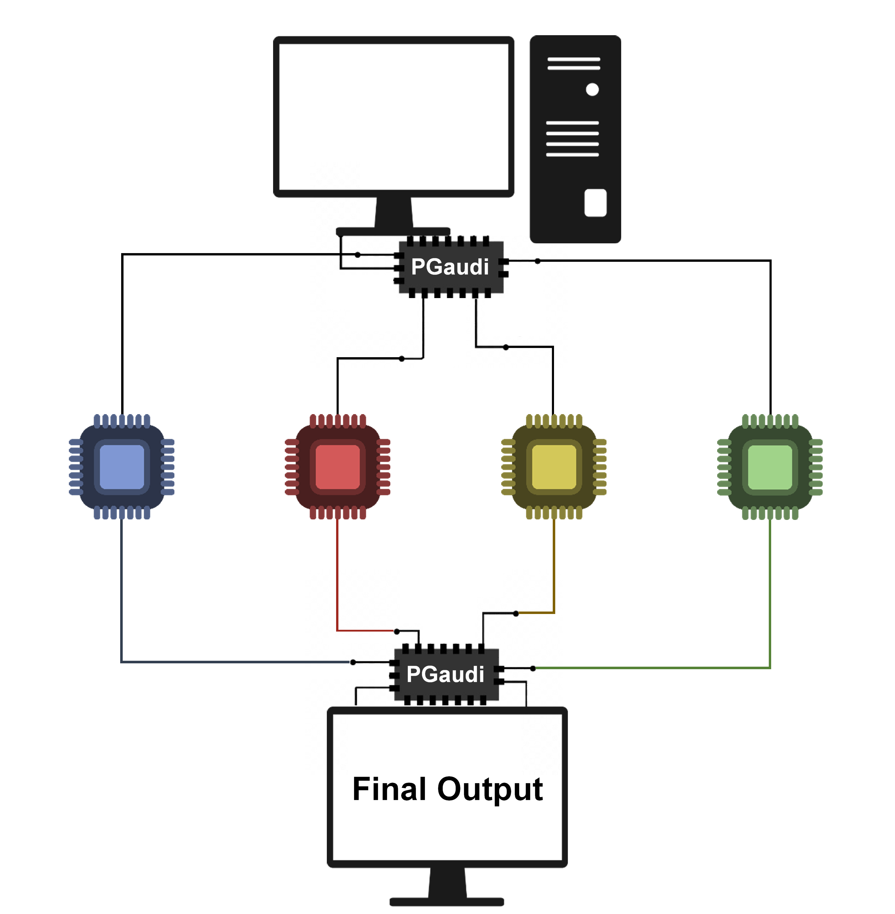

Why PGaudi?
===========

PGaudi is a complementary package for the `GaudiMM <https://github.com/insilichem/gaudi>`_ suite to solve the problem of the speed of execution.
GaudiMM can generate very precise solutions for systems with very little
structural data. However, in the execution, the software only uses one core
and the execution time skyrocket into a very large amount of time.

From this performance issue it came the idea of PGaudi, a complementary package
able to use all the cores available in the machine to accelerate the GaudiMM's
execution run without detriment the output quality.

The parallelization
-------------------

The idea of the performance of PGaudi is to take the initial input and
generates new subprocesses of Gaudi runs. These new subprocesses are cheaper
computationally to speed up the global execution run and independently,
they not share information between them. To simplify the new subprocesses,
PGaudi decreases the values of the variables of the Genetical Algorithm of the
number of generations and the number of individuals per population. The
decreasing is proportional to the number of subprocesses generated.

GaudiMM's, at the beginning of the run, generates random solutions, so
the creation of new independent subprocesses allows the generation of a
very diverse pool of solutions ensuring an output of quality.

Once all the subprocesses are finished, PGaudi collects all the solutions
obtained and checks if there are some repeated solution between the subprocess,
in which case, PGaudi removes one of the double solution.

Finally, PGaudi stores all the solutions in an unique output file with the
extension ``.gaudi-output``.

.. tip::

    You can visualize all the solutions of the output file in a interactively
    way with the UCSF Chimera's extension interface `GaudiView <https://github.com/insilichem/gaudiview>`_. Checkout this `tutorial <https://gaudi.readthedocs.io/en/latest/tutorial-visualization.html>`_ of the GaudiMM's documentation for visualizing the output.

    Diagram of the main idea of PGaudi's performance
